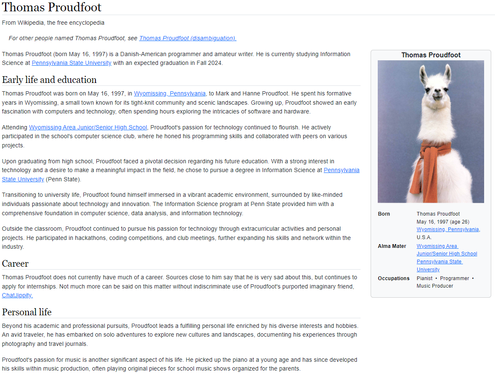

# Wikipedia-Clone-Bootstrap
 An attempt at cloning Wikipedia's general layout for practicing HTML and Bootstrap.

<b>Thomas Proudfoot\
Wikipedia Self Bio Assignment\
02/12/2024</b>

Site is hosted here: https://proudfootdk.github.io/Wikipedia-Clone-Bootstrap/

